# 基于用户行为分析的实时信息流排序与分发系统的设计与开发

## 毕业设计说明书

> 项目名称：recommendation-system  
> 系统类型：类 X/Twitter 社交媒体推荐系统  
> 技术栈：Spring Boot 3.2.1、Vue 3、MySQL、Redis、WebSocket、ECharts、Ollama、DeepSeek API  
> 说明：本文档依据当前项目代码编写，图表与系统实际模块、接口和数据模型保持一致。

---

## 摘要

随着社交媒体内容规模不断增长，传统时间倒序信息流难以满足用户个性化阅读需求。本文设计并实现了一套基于用户行为分析的实时信息流排序与分发系统。系统采用前后端分离架构，后端基于 Spring Boot 提供 RESTful API，前端基于 Vue 3 构建单页应用，数据库采用 MySQL 存储用户、内容、行为、关注、通知、广告等业务数据。系统支持用户注册登录、内容发布、评论、点赞、转发、引用、关注、搜索、实时通知、私信、用户画像、广告投放和后台管理等功能。

在推荐算法方面，系统采集浏览、点赞、评论、转发、搜索、点踩、跳过等行为数据，构建用户兴趣画像，并融合多行为加权评分、TF-IDF 内容相似度、协同过滤、时间衰减、热门话题加成、负反馈过滤、作者多样性惩罚和加权随机采样等策略，实现个性化信息流排序。同时，系统集成 Ollama 本地大模型作为 AI 推荐策略，并支持管理员在传统多因子推荐与 AI 推荐之间切换。系统还提供算法效果对比、参数调节、排序管道漏斗图和用户画像可视化，便于展示推荐排序效果。

关键词：信息流推荐；用户行为分析；用户画像；协同过滤；TF-IDF；Spring Boot；Vue

---

## Abstract

With the rapid growth of social media content, traditional chronological feeds can no longer satisfy users' personalized reading needs. This project designs and implements a real-time feed ranking and distribution system based on user behavior analysis. The system adopts a front-end and back-end separated architecture. The back end is built with Spring Boot and provides RESTful APIs, while the front end is implemented as a Vue 3 single-page application. MySQL is used to store users, posts, behaviors, relationships, notifications, advertisements and other business data.

The system supports user authentication, post publishing, comments, likes, reposts, quotes, following, search, real-time notifications, private messages, user personas, advertisement delivery and administrator management. For recommendation, the system collects behavior events such as views, likes, comments, reposts, searches, dislikes and skips, builds user interest profiles, and combines multi-behavior weighted scoring, TF-IDF content similarity, collaborative filtering, time decay, trending topic boosting, negative feedback filtering, author diversity penalty and weighted random sampling. In addition, an Ollama-based AI recommendation strategy is integrated, and administrators can switch between the traditional hybrid strategy and the AI strategy. The system also provides recommendation comparison, parameter tuning, pipeline funnel visualization and user persona visualization for demonstration and evaluation.

Keywords: feed recommendation; user behavior analysis; user persona; collaborative filtering; TF-IDF; Spring Boot; Vue

---

## 第 1 章 绪论

### 1.1 课题背景

移动互联网和社交媒体平台的发展使用户每天接触到大量信息。传统的信息流通常按照发布时间进行倒序排列，这种方式实现简单，但无法充分考虑用户兴趣、内容质量和行为反馈。当内容数量增多时，用户需要花费更多时间筛选信息，容易出现信息过载问题。

以 X、微博、抖音、B 站等平台为代表的现代内容平台，普遍采用推荐算法对信息流进行排序。系统通过分析用户浏览、点赞、评论、转发、搜索、关注等行为，构建用户画像，再结合内容特征、社交关系、热门趋势和时间因素进行综合排序，从而提升内容分发效率和用户体验。

本课题以类 X/Twitter 社交媒体平台为业务场景，设计并实现一个基于用户行为分析的实时信息流排序与分发系统。系统不仅实现基础社交功能，还重点实现推荐算法、用户画像、算法可视化和广告智能分发模块。

### 1.2 课题目的和意义

本课题的主要目的如下：

1. 设计一个前后端分离的社交媒体信息流系统。
2. 建立统一的用户行为数据模型，采集用户多维行为。
3. 构建用户画像，分析用户兴趣、活跃度和行为类型。
4. 实现混合多因子推荐排序算法。
5. 提供推荐效果可视化对比，支持答辩演示。
6. 集成 AI 助手、AI 推荐和广告智能投放功能。

本课题的意义在于将 Web 应用开发、数据库设计、推荐算法、数据可视化、实时通信和 AI 集成等内容结合起来，形成一个较完整的软件工程项目。

### 1.3 本文组织结构

本文按照软件工程开发流程组织内容。第 2 章进行可行性分析；第 3 章进行需求分析；第 4 章进行系统分析；第 5 章进行概要设计；第 6 章进行数据库设计；第 7 章进行详细设计；第 8 章说明系统实现；第 9 章说明系统测试；第 10 章进行总结与展望。

---

## 第 2 章 可行性分析

### 2.1 技术可行性

系统采用成熟的 B/S 架构和前后端分离设计。后端使用 Spring Boot，便于快速开发 RESTful API，并通过 Spring Data JPA 操作数据库。前端使用 Vue 3 和 Element Plus 构建交互界面，使用 ECharts 展示统计图表。MySQL 用于持久化业务数据，WebSocket 用于通知和私信实时推送，Ollama 和 DeepSeek API 用于 AI 能力集成。

表 2-1 为系统主要技术选型。

| 层次 | 技术 | 用途 |
|---|---|---|
| 前端框架 | Vue 3、Vite | 构建单页应用 |
| UI 组件 | Element Plus | 页面组件、表格、弹窗、按钮 |
| 图表 | ECharts、echarts-wordcloud | 用户画像、推荐对比、广告报表 |
| 后端框架 | Spring Boot 3.2.1 | REST API、业务服务 |
| 数据访问 | Spring Data JPA | 操作 MySQL 数据库 |
| 数据库 | MySQL | 存储用户、帖子、行为、广告等数据 |
| 实时通信 | WebSocket、STOMP、SockJS | 通知和私信推送 |
| AI 能力 | Ollama、DeepSeek API | AI 推荐、AI 打标、AI 聊天助手 |
| 数据导入 | X API、Python 爬虫 | 导入外部推文数据 |

### 2.2 经济可行性

系统主要依赖开源框架和本地开发环境，开发成本较低。MySQL、Spring Boot、Vue、ECharts 等均可免费使用。AI 模块可通过本地 Ollama 模型运行，降低外部调用成本。系统适合作为毕业设计项目完成。

### 2.3 操作可行性

系统采用类社交媒体交互方式，用户可通过登录、发帖、点赞、评论、关注等常见操作使用系统。管理员可通过后台页面完成用户管理、推荐策略切换、AI 打标、X 推文爬取和广告管理。整体操作方式符合普通 Web 用户习惯。

### 2.4 可行性分析结论

综合技术、经济和操作可行性分析，本系统开发条件成熟，功能目标明确，所选技术能够支撑系统实现，具备开发和演示可行性。

---

## 第 3 章 需求分析

### 3.1 用户角色分析

系统包含两类主要角色：普通用户和管理员。

| 角色 | 权限和职责 |
|---|---|
| 普通用户 | 注册登录、浏览信息流、发布帖子、评论、点赞、点踩、转发、引用、关注用户、搜索内容、查看通知、发送私信、查看个人画像 |
| 管理员 | 管理用户、切换用户角色、封禁用户、查看平台统计、AI 批量打标、切换推荐策略、爬取 X 推文、管理广告 |

### 3.2 功能需求

系统功能需求如表 3-1 所示。

| 模块 | 功能需求 |
|---|---|
| 用户模块 | 注册、登录、资料查看、资料编辑、头像上传、角色管理、封禁管理 |
| 内容模块 | 发帖、图片上传、评论、多级回复、转发、引用、删除、查看帖子详情 |
| 社交模块 | 关注、取关、关注状态查询、关注列表、粉丝列表、推荐关注 |
| 行为模块 | 记录浏览、点赞、点踩、跳过、搜索等行为 |
| 推荐模块 | 个性化推荐、关注流、传统推荐策略、AI 推荐策略、策略切换 |
| 用户画像模块 | 兴趣标签、行为统计、活跃时段、用户类型、内容偏好、词云、雷达图 |
| 搜索模块 | 综合搜索、帖子搜索、用户搜索、话题搜索、搜索建议 |
| 热门话题模块 | 根据标签和互动数据计算热门话题 |
| 通知模块 | 点赞、评论、关注、转发、引用通知，未读数，标记已读 |
| 私信模块 | 会话列表、聊天记录、发送私信、实时消息提醒 |
| 广告模块 | 信息流广告插入、广告匹配、广告 CRUD、广告统计 |
| 统计分析模块 | 平台总览、行为分布、用户阶段分布、内容生态、负反馈和广告摘要 |
| 管理模块 | 用户管理、平台统计、推荐策略管理、X 推文爬取、AI 打标 |
| 数据导入模块 | X API 导入、内置内容库补齐、JSON 文件导入 |

### 3.3 非功能需求

| 类型 | 需求说明 |
|---|---|
| 可用性 | 页面操作清晰，用户可快速完成发帖、互动和浏览 |
| 可维护性 | 后端按 controller、service、repository、model 分层组织 |
| 可扩展性 | 推荐策略通过策略模式管理，可扩展新的推荐策略 |
| 实时性 | 通知和私信通过 WebSocket 实时推送 |
| 可视化 | 用户画像、推荐对比、广告统计通过图表展示 |
| 安全性 | 系统提供 JWT Token 生成和请求头携带机制，演示环境下部分接口采用软校验，后续部署可加强后端角色拦截 |

### 3.4 用例图

图 3-1 为系统用例图。

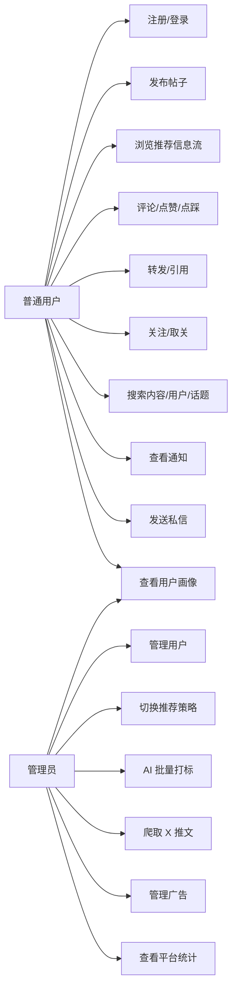

### 3.5 需求分析小结

根据需求分析，系统应同时满足社交媒体基础业务和推荐算法展示需求。其中推荐排序、用户画像、行为采集、算法可视化和广告分发是系统核心功能。

---

## 第 4 章 系统分析

### 4.1 系统业务流程分析

用户进入系统后，首先进行注册或登录。登录成功后进入首页信息流，系统根据用户 ID 构建候选内容池，并结合用户行为画像生成个性化推荐结果。用户在浏览过程中产生点赞、点踩、评论、转发、搜索等行为，这些行为被写入行为表，并参与后续用户画像和推荐排序。

图 4-1 为系统总体业务流程图。

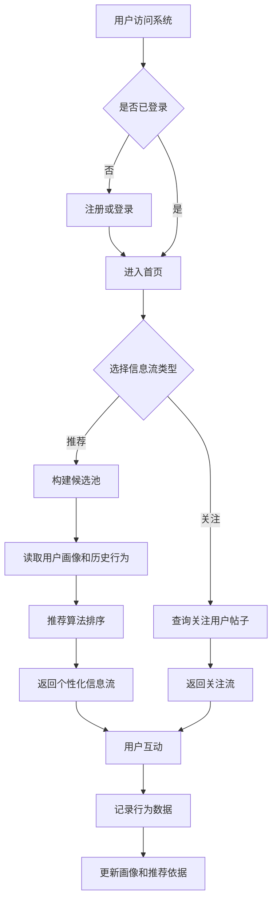

### 4.2 内容发布流程分析

用户发布帖子时，前端先判断是否包含图片。如果包含图片，先调用上传接口获取图片访问地址，再调用发帖接口保存帖子。后端保存帖子后会解析正文中的显式话题标签，并异步调用 AI 打标服务生成语义标签。

图 4-2 为内容发布流程图。

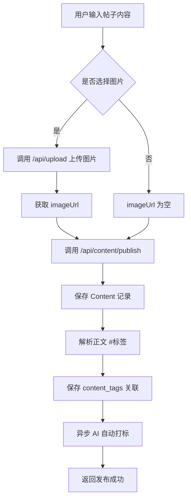

### 4.3 推荐信息流流程分析

系统推荐信息流的核心流程包括候选池构建、负反馈过滤、用户画像读取、协同过滤加成、多因子评分、作者多样性惩罚和加权随机采样。

图 4-3 为推荐信息流排序流程图。

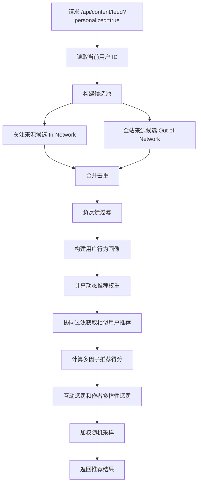

### 4.4 数据流分析

系统数据主要在前端页面、后端业务服务、数据库、AI 服务和外部数据源之间流动。

图 4-4 为系统一层数据流图。

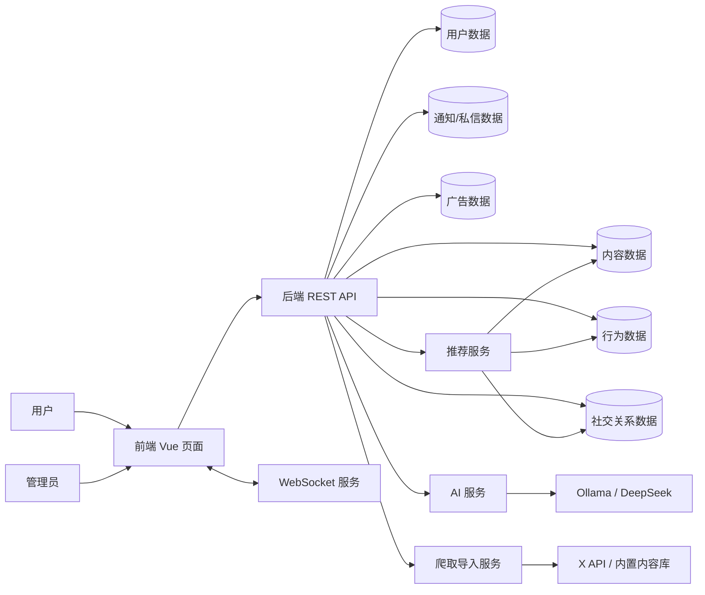

### 4.5 数据字典

表 4-1 为核心数据字典。

| 数据项 | 含义 | 来源 | 去向 |
|---|---|---|---|
| userId | 用户唯一标识 | 登录用户、请求参数 | 内容、行为、关注、通知、推荐 |
| contentId | 帖子唯一标识 | 内容表 | 行为、评论、通知、推荐 |
| behaviorType | 行为类型 | 用户操作 | 用户画像、推荐算法 |
| tagName | 标签名称 | 发帖解析、AI 打标 | 搜索、热门话题、推荐 |
| scoreBreakdown | 推荐得分详情 | 推荐算法 | 前端评分面板、对比实验 |
| negativeSignal | 负反馈信号 | 不感兴趣、屏蔽、静音 | 推荐过滤 |
| adScore | 广告匹配分 | 广告服务 | 信息流广告插入 |

---

## 第 5 章 概要设计

### 5.1 系统总体架构

系统采用 B/S 架构和前后端分离模式。前端通过 Axios 调用后端 REST API，通过 SockJS/STOMP 建立 WebSocket 连接。后端按控制层、业务层、数据访问层和数据模型层组织。数据库保存业务数据，AI 服务和 X API 作为外部能力接入。

图 5-1 为系统总体架构图。

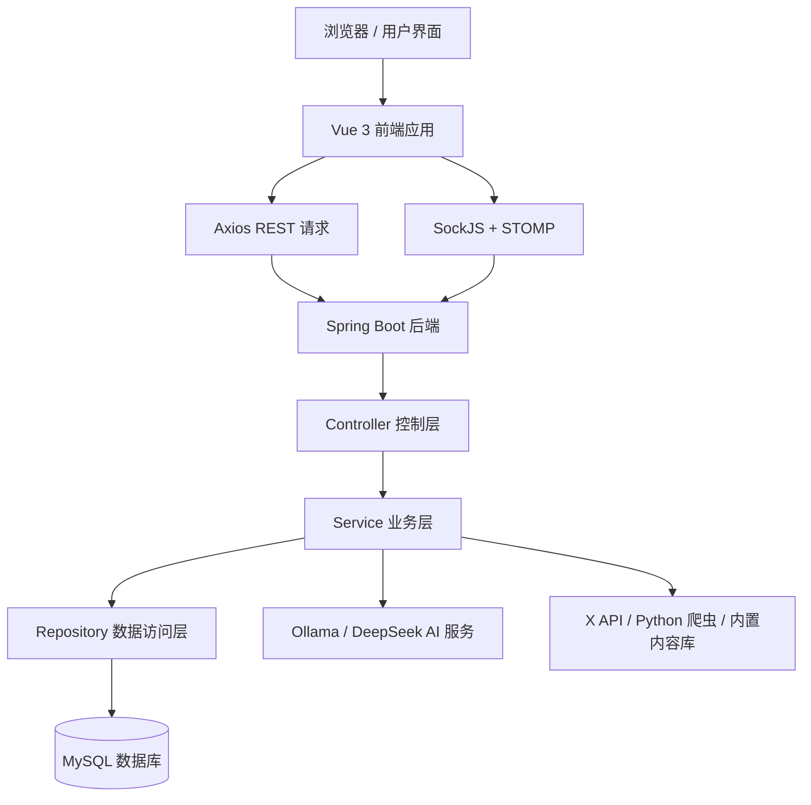

### 5.2 系统功能模块设计

图 5-2 为系统功能模块结构图。

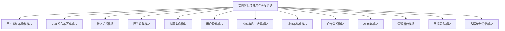

### 5.3 后端分层设计

| 层次 | 包路径 | 职责 |
|---|---|---|
| 控制层 | `controller` | 接收 HTTP 请求，返回 API 响应 |
| 业务层 | `service` | 实现推荐、画像、内容、广告、通知等业务逻辑 |
| 数据访问层 | `repository` | 基于 JPA 操作数据库 |
| 数据模型层 | `model` | 定义用户、内容、行为等实体 |
| 数据传输层 | `dto` | 封装推荐评分、搜索结果、热门话题等返回结构 |
| 配置层 | `config` | 安全、跨域、WebSocket、Redis、文件映射等配置 |

### 5.4 前端页面设计

| 页面 | 组件文件 | 功能 |
|---|---|---|
| 首页 | `HomeView.vue`、`FeedList.vue` | 推荐流、关注流、发帖、广告插入 |
| 登录页 | `LoginView.vue` | 用户登录 |
| 注册页 | `RegisterView.vue` | 用户注册 |
| 个人主页 | `ProfileView.vue` | 用户资料、帖子、回复、喜欢、画像 |
| 搜索页 | `SearchView.vue` | 综合搜索结果 |
| 通知页 | `NotificationView.vue` | 通知列表、标记已读 |
| 私信页 | `MessagesView.vue` | 会话列表、聊天窗口 |
| 管理页 | `AdminView.vue` | 用户管理、策略切换、AI 打标、X 爬取 |
| 算法验证页 | `CompareView.vue` | 推荐对比、千人千面、漏斗图、调参 |
| 广告报表页 | `AdDashboard.vue` | 广告管理、投放配置、统计图表 |
| AI 助手页 | `GrokView.vue` | AI 对话 |

---

## 第 6 章 数据库设计

### 6.1 概念结构设计

系统核心实体包括用户、帖子、行为、标签、关注、通知、私信、负反馈、广告和广告配置。

图 6-1 为系统 E-R 图。

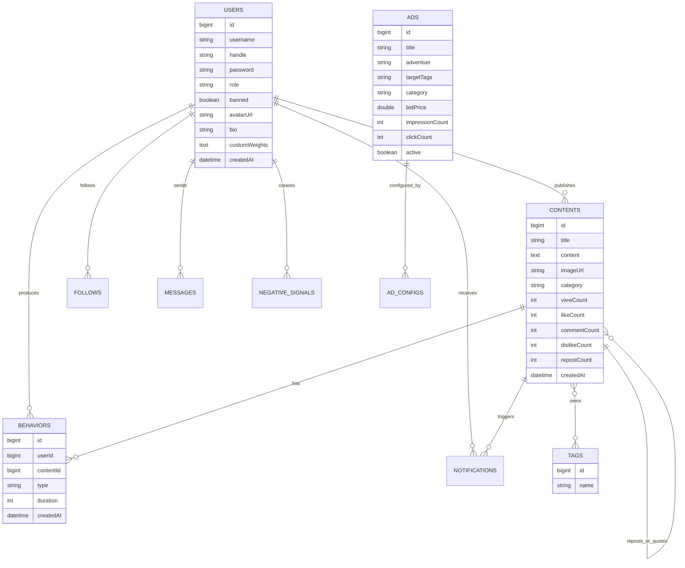

### 6.2 逻辑结构设计

表 6-1 为用户表设计。

| 字段 | 类型 | 说明 |
|---|---|---|
| id | BIGINT | 用户 ID |
| username | VARCHAR | 用户名，唯一 |
| handle | VARCHAR | 用户昵称标识，如 `@user1` |
| avatarUrl | VARCHAR | 头像地址 |
| bio | VARCHAR | 个人简介 |
| password | VARCHAR | 登录密码 |
| role | VARCHAR | USER 或 ADMIN |
| banned | BOOLEAN | 是否封禁 |
| customWeights | TEXT | 用户自定义推荐权重 JSON |
| createdAt | DATETIME | 创建时间 |

表 6-2 为内容表设计。

| 字段 | 类型 | 说明 |
|---|---|---|
| id | BIGINT | 帖子 ID |
| author | BIGINT | 作者 ID |
| parentContent | BIGINT | 父评论 ID |
| content | TEXT | 正文 |
| imageUrl | VARCHAR | 图片地址 |
| category | VARCHAR | 内容分类 |
| viewCount | INT | 浏览数 |
| likeCount | INT | 点赞数 |
| commentCount | INT | 评论数 |
| dislikeCount | INT | 点踩数 |
| repostCount | INT | 转发/引用数 |
| repostOf | BIGINT | 转发原帖 |
| quoteOf | BIGINT | 引用原帖 |
| createdAt | DATETIME | 发布时间 |

表 6-3 为行为表设计。

| 字段 | 类型 | 说明 |
|---|---|---|
| id | BIGINT | 行为 ID |
| userId | BIGINT | 用户 ID |
| contentId | BIGINT | 内容 ID |
| type | VARCHAR | VIEW、LIKE、DISLIKE、SKIP、SEARCH 等 |
| duration | INT | 浏览停留时长 |
| createdAt | DATETIME | 行为时间 |

表 6-4 为关注表设计。

| 字段 | 类型 | 说明 |
|---|---|---|
| id | BIGINT | 关注记录 ID |
| followerId | BIGINT | 关注者 |
| followeeId | BIGINT | 被关注者 |
| createdAt | DATETIME | 关注时间 |

表 6-5 为通知表设计。

| 字段 | 类型 | 说明 |
|---|---|---|
| id | BIGINT | 通知 ID |
| recipientId | BIGINT | 接收者 |
| actorId | BIGINT | 触发者 |
| type | VARCHAR | LIKE、COMMENT、FOLLOW、REPOST、QUOTE |
| entityId | BIGINT | 关联帖子 ID |
| isRead | BOOLEAN | 是否已读 |
| createdAt | DATETIME | 通知时间 |

表 6-6 为广告表设计。

| 字段 | 类型 | 说明 |
|---|---|---|
| id | BIGINT | 广告 ID |
| title | VARCHAR | 广告标题 |
| description | VARCHAR | 广告描述 |
| imageUrl | VARCHAR | 广告图片 |
| targetUrl | VARCHAR | 跳转地址 |
| advertiser | VARCHAR | 广告主 |
| targetTags | VARCHAR | 定向标签 |
| category | VARCHAR | 广告分类 |
| bidPrice | DOUBLE | CPM 出价 |
| impressionCount | INT | 展示次数 |
| clickCount | INT | 点击次数 |
| active | BOOLEAN | 是否启用 |

---

## 第 7 章 详细设计

### 7.1 用户认证模块设计

用户注册时，系统检查用户名是否重复，保存用户信息，并生成 JWT Token 返回前端。用户登录时，系统验证用户名、密码和封禁状态，验证通过后返回用户信息和 Token。前端将用户信息和 Token 保存在 localStorage 中，并在后续请求中通过 Authorization 请求头携带 Token。

图 7-1 为登录流程图。

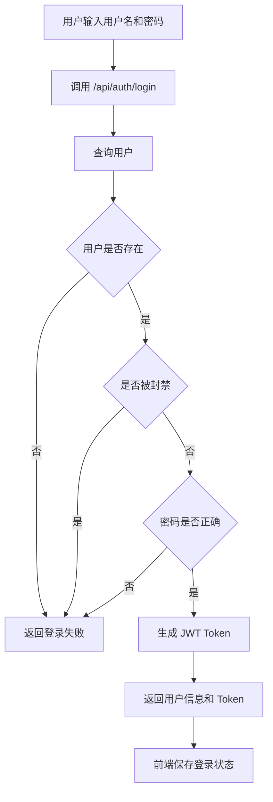

### 7.2 内容与互动模块设计

内容模块提供发帖、评论、转发、引用、删除和查询接口。评论本质上也是 Content，通过 parentContent 字段关联父内容。转发和引用分别通过 repostOf 和 quoteOf 字段关联原帖。

表 7-1 为内容模块核心接口。

| 接口 | 方法 | 功能 |
|---|---|---|
| `/api/content/publish` | POST | 发布帖子 |
| `/api/content/feed` | GET | 获取信息流 |
| `/api/content/following` | GET | 获取关注流 |
| `/api/content/{id}` | GET | 获取帖子详情 |
| `/api/content/{id}/comment` | POST | 发布评论 |
| `/api/content/{id}/comments` | GET | 获取评论 |
| `/api/content/{id}/repost` | POST | 转发 |
| `/api/content/{id}/quote` | POST | 引用 |
| `/api/content/{id}` | DELETE | 删除帖子 |

互动模块负责记录点赞、浏览、点踩和跳过行为。点赞和点踩互斥，浏览行为会记录停留时长，停留时间较长的内容会在推荐中被视为已浏览内容并适当降权，避免重复推荐。

表 7-2 为行为模块核心接口。

| 接口 | 方法 | 功能 |
|---|---|---|
| `/api/behavior/like` | POST | 点赞内容 |
| `/api/behavior/view` | POST | 记录浏览 |
| `/api/behavior/dislike` | POST | 点踩内容 |
| `/api/behavior/skip` | POST | 记录跳过 |

### 7.3 推荐算法详细设计

系统推荐模块采用策略模式，包含传统多因子推荐和 AI 推荐两种策略。管理员可在后台切换当前策略。

图 7-2 为推荐策略结构图。

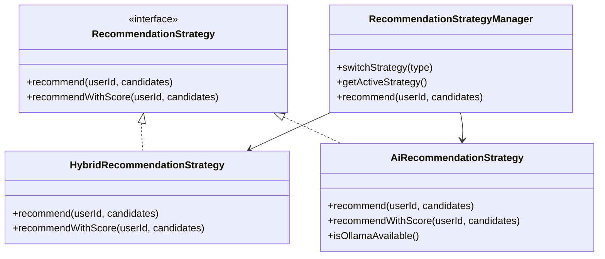

传统推荐算法综合以下因子：

1. 多行为加权互动分。
2. 互动率因子。
3. 关注来源加成。
4. 个性化标签匹配。
5. 用户画像话题亲和度。
6. 作者偏好加成。
7. TF-IDF 内容相似度。
8. 热门话题加成。
9. 协同过滤加成。
10. 内容深度匹配。
11. 新鲜度偏好。
12. 时间衰减。
13. 点踩、点赞、浏览惩罚。
14. 作者多样性惩罚。
15. 随机探索因子。

推荐评分公式可表示为：

```text
finalScore =
    engagement / timeDecay
  + topicAffinity
  + authorAffinity
  + personalizationBoost
  + tfidfSimilarityBoost
  + trendingBoost
  + collaborativeBoost
  + depthMatchBoost
  + freshnessBoost
  + jitter
```

如果用户已经对内容产生过负向或重复行为，则再乘以惩罚系数：

```text
已点踩：score = score * 0.1
已点赞：score = score * 0.5
已浏览：score = score * 0.7
```

时间衰减采用分段策略。0 到 6 小时内容保持较高新鲜度，6 到 24 小时正常衰减，24 到 72 小时加速衰减，72 小时以上进入长尾阶段。

### 7.4 用户画像模块详细设计

用户画像由行为数据驱动生成。系统根据用户历史行为统计话题偏好、作者偏好、互动风格、内容深度偏好、新鲜度偏好和探索度，并据此计算动态推荐权重。

图 7-3 为用户画像构建流程图。

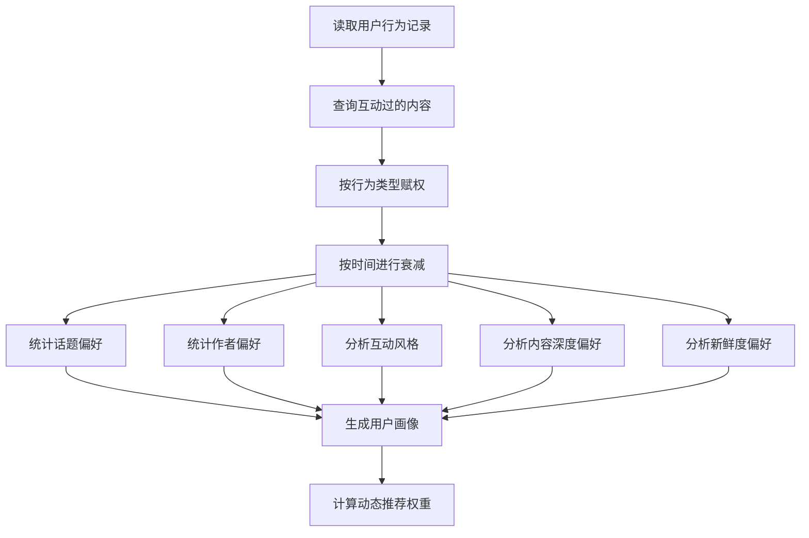

用户阶段划分如下：

| 阶段 | 条件 | 推荐策略特点 |
|---|---|---|
| 冷启动用户 | 行为数少于 10 | 更依赖热门内容和探索 |
| 初级用户 | 行为数 10 到 49 | 热门和个性化混合 |
| 活跃用户 | 行为数不少于 50 | 更依赖个性化、协同过滤和兴趣画像 |

### 7.5 搜索与热门话题设计

搜索模块支持帖子、用户和话题综合搜索。用户输入关键词后，系统可返回搜索建议。若关键词以 `#` 开头，则优先搜索话题；若以 `@` 开头，则优先搜索用户。

热门话题模块基于近期内容的标签和互动量计算热门程度。推荐算法会检测内容是否包含热门话题，并对相关内容增加得分。

### 7.6 通知与私信设计

系统通过 WebSocket 实现通知和私信推送。后端使用 STOMP 用户队列向指定用户推送消息。

图 7-4 为通知推送流程图。

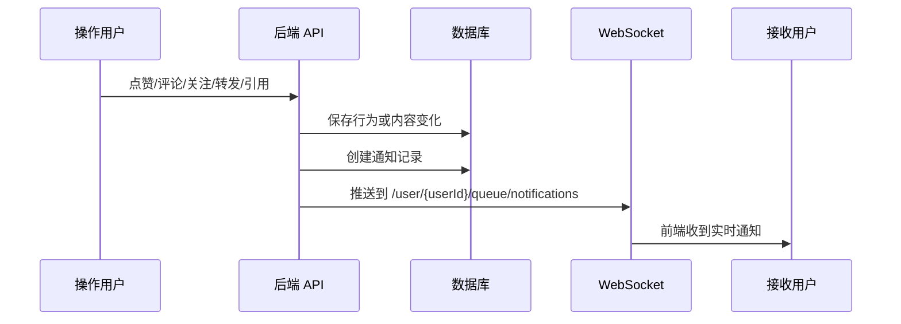

### 7.7 广告智能分发设计

广告模块根据用户画像的兴趣标签和广告定向标签进行匹配，并结合广告出价和历史点击率计算广告得分。

广告得分公式如下：

```text
adScore = matchedTagCount * 30 + bidPrice * 10 + qualityScore
qualityScore = CTR * 100
```

信息流前端根据广告配置，将广告按指定间隔插入帖子列表中。

图 7-5 为广告分发流程图。

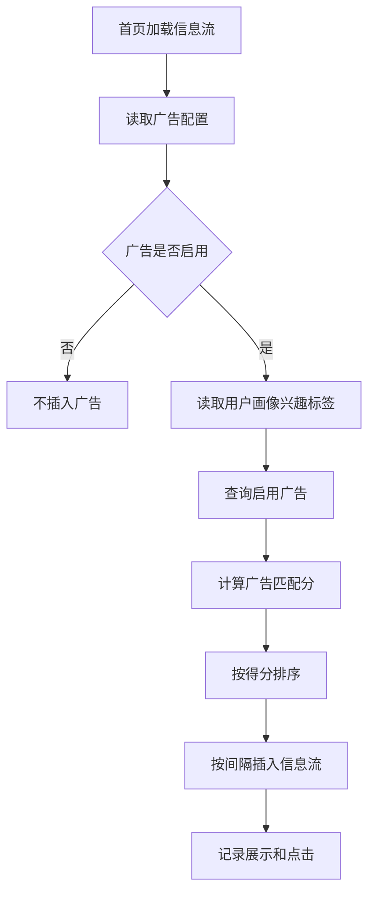

### 7.8 数据导入设计

系统支持三种内容导入方式：

| 方式 | 接口或入口 | 说明 |
|---|---|---|
| 用户发布 | `/api/content/publish` | 普通用户主动发布帖子 |
| X 批量爬取 | `/api/admin/crawl-x-batch` | 管理员一键导入指定数量推文 |
| 指定用户爬取 | `/api/admin/crawl-x` | 管理员指定 X 用户名导入 |
| JSON 文件导入 | `/api/admin/import/x` | 读取 `scraped_data.json` 文件导入 |
| 启动种子数据 | `DataSeeder` | 数据库为空时生成模拟用户和帖子 |

---

## 第 8 章 系统实现

### 8.1 开发环境

| 项目 | 配置 |
|---|---|
| 操作系统 | Windows |
| 后端运行环境 | JDK 17、Maven |
| 前端运行环境 | Node.js、npm |
| 后端端口 | 8888 |
| 前端端口 | 5173 |
| 数据库 | MySQL `rec_db` |
| WebSocket 地址 | `http://localhost:8888/ws` |
| API 基础地址 | `http://localhost:8888/api` |

### 8.2 用户端功能实现

用户端主要包括首页信息流、发帖框、帖子卡片、个人主页、搜索页、通知页和私信页。

首页信息流默认显示个性化推荐内容，用户可以切换到关注流。推荐流支持评分面板显示，便于展示推荐原因。用户发帖时可以上传图片，系统会自动解析标签并进行 AI 打标。

### 8.3 管理端功能实现

管理端包括平台统计、用户管理、推荐策略切换、AI 批量打标、X 推文爬取和用户画像查看。管理员可将用户切换为普通用户或管理员，也可封禁用户。推荐策略切换后会全局影响推荐服务。

### 8.4 算法验证功能实现

算法验证页提供三类展示：

1. 当前用户行为画像。
2. 千人千面对比，展示不同用户的动态权重和 Top 5 推荐结果。
3. 推荐算法和时间倒序的双栏对比，展示平均分、标签命中率、TF-IDF 相似度、平均互动量和个性化提升倍率。

### 8.5 广告报表实现

广告报表页提供广告配置、广告创建和编辑、展示量、点击量、CTR、预估收入、类别 CTR 等统计信息。系统在首页信息流中根据广告间隔配置插入广告卡片。

### 8.6 数据统计中心实现

数据统计中心用于展示系统整体运行情况，与算法验证页面形成分工。算法验证页面重点展示推荐流与时间流的对比、推荐得分和推荐管道漏斗；数据统计中心重点展示平台总体规模、用户行为分布、用户阶段分布、内容分类分布、全站热门话题、用户兴趣标签、高互动帖子、负反馈统计和广告分发摘要。后端通过 `/api/analytics/dashboard` 聚合返回统计数据，前端使用 ECharts 绘制折线图、饼图、柱状图和排行榜。

### 8.7 核心 API 汇总

| 模块 | 接口 | 方法 | 说明 |
|---|---|---|---|
| 认证 | `/api/auth/register` | POST | 注册 |
| 认证 | `/api/auth/login` | POST | 登录 |
| 用户 | `/api/user/{id}` | GET | 获取用户 |
| 用户 | `/api/user/{id}` | PUT | 编辑用户 |
| 内容 | `/api/content/feed` | GET | 信息流 |
| 内容 | `/api/content/publish` | POST | 发帖 |
| 内容 | `/api/content/{id}/comment` | POST | 评论 |
| 行为 | `/api/behavior/like` | POST | 点赞 |
| 行为 | `/api/behavior/view` | POST | 浏览 |
| 关系 | `/api/relation/follow` | POST | 关注 |
| 搜索 | `/api/search` | GET | 综合搜索 |
| 热门 | `/api/trending` | GET | 热门话题 |
| 通知 | `/api/notifications` | GET | 通知列表 |
| 私信 | `/api/messages` | POST | 发送私信 |
| 画像 | `/api/user/{id}/persona` | GET | 用户画像 |
| 对比 | `/api/compare/feed` | GET | 推荐效果对比 |
| 广告 | `/api/ads/relevant` | GET | 匹配广告 |
| 统计 | `/api/analytics/dashboard` | GET | 数据统计中心聚合数据 |
| 管理 | `/api/admin/stats` | GET | 平台统计 |
| 管理 | `/api/admin/rec-strategy` | PUT | 切换推荐策略 |
| 管理 | `/api/admin/crawl-x-batch` | POST | 批量爬取 X 推文 |

---

## 第 9 章 系统测试

### 9.1 测试环境

| 项目 | 内容 |
|---|---|
| 后端 | Spring Boot 3.2.1 |
| 前端 | Vue 3、Vite |
| 数据库 | MySQL |
| 浏览器 | Chrome / Edge |
| 构建验证 | 后端 `mvn -q test`，前端 `npm run build` |

### 9.2 功能测试用例

表 9-1 为系统主要功能测试用例。

| 编号 | 测试模块 | 测试内容 | 预期结果 | 结果 |
|---|---|---|---|---|
| T01 | 注册登录 | 输入用户名和密码注册 | 注册成功并返回用户信息和 Token | 通过 |
| T02 | 登录 | 使用正确账号登录 | 登录成功并进入首页 | 通过 |
| T03 | 发帖 | 输入文字发布帖子 | 首页出现新帖子 | 通过 |
| T04 | 图片发帖 | 上传图片后发布 | 图片地址保存并展示 | 通过 |
| T05 | 评论 | 对帖子发表评论 | 评论数增加并生成通知 | 通过 |
| T06 | 点赞 | 点赞帖子 | 点赞数增加并记录行为 | 通过 |
| T07 | 点踩 | 点踩已点赞帖子 | 点赞取消，点踩数增加 | 通过 |
| T08 | 关注 | 关注其他用户 | 关注状态变为已关注 | 通过 |
| T09 | 推荐流 | 访问个性化推荐 | 返回带排序结果的信息流 | 通过 |
| T10 | 关注流 | 访问关注流 | 返回关注用户发布内容 | 通过 |
| T11 | 搜索 | 搜索关键词 | 返回帖子、用户和话题结果 | 通过 |
| T12 | 热门话题 | 查看右侧热门话题 | 返回热门标签列表 | 通过 |
| T13 | 通知 | 他人点赞或评论 | 接收通知并可标记已读 | 通过 |
| T14 | 私信 | 发送私信 | 对方收到消息提醒 | 通过 |
| T15 | 用户画像 | 查看个人主页画像 | 展示词云、雷达图和偏好数据 | 通过 |
| T16 | 管理后台 | 切换推荐策略 | 策略切换成功 | 通过 |
| T17 | X 爬取 | 一键爬取推文 | 导入新帖子或从内容库补齐 | 通过 |
| T18 | 广告 | 获取匹配广告 | 信息流按间隔插入广告 | 通过 |

### 9.3 推荐算法测试

表 9-2 为推荐算法测试项。

| 测试项 | 测试方法 | 预期效果 |
|---|---|---|
| 标签匹配 | 用户点赞某类内容后刷新推荐 | 同类标签内容得分提高 |
| 时间衰减 | 对比新旧内容得分 | 新内容获得更高新鲜度优势 |
| 负反馈过滤 | 对作者屏蔽或对内容不感兴趣 | 对应内容不再进入推荐候选 |
| 协同过滤 | 构造相似用户行为 | 相似用户喜欢的内容获得加成 |
| 作者多样性 | 候选集中同作者多篇内容 | 同作者后续内容降权 |
| 推荐对比 | 推荐流和时间流并排展示 | 推荐流平均分和标签命中率更高 |

### 9.4 构建测试

系统进行了基础构建验证：

| 项目 | 命令 | 结果 |
|---|---|---|
| 后端 | `mvn -q test` | 通过 |
| 前端 | `npm run build` | 通过，存在 chunk 体积提示，不影响构建 |

### 9.5 测试小结

测试结果表明，系统主要功能能够正常运行，推荐、画像、广告、通知和管理后台等核心模块具备演示能力。当前系统主要面向毕业设计展示，后续可进一步补充自动化测试、压力测试和更严格的后端权限校验。

---

## 第 10 章 总结与展望

### 10.1 工作总结

本文设计并实现了一套基于用户行为分析的实时信息流排序与分发系统。系统完成了用户认证、内容发布、社交互动、搜索、热门话题、实时通知、私信、用户画像、个性化推荐、AI 推荐、算法对比、广告分发和后台管理等功能。

系统的核心成果包括：

1. 建立了用户、内容、行为、关注、标签、通知、广告等完整数据模型。
2. 实现了基于用户行为画像的混合多因子推荐算法。
3. 实现了 TF-IDF、协同过滤、时间衰减、负反馈过滤和作者多样性惩罚。
4. 实现了推荐效果可视化对比和排序管道漏斗图。
5. 实现了用户画像可视化，包括词云、雷达图、偏好分布和活跃度分析。
6. 实现了广告智能分发和广告统计报表。
7. 集成了 AI 打标、AI 聊天助手和 AI 推荐策略。

### 10.2 展望

本系统围绕“基于用户行为分析的实时信息流排序与分发”这一主题，完成了从需求分析、系统设计、数据库建模、核心算法实现到前后端联调和功能测试的完整开发过程。系统功能覆盖普通用户端、管理员端、推荐算法端和数据可视化端，能够较完整地展示社交媒体信息流推荐系统的主要业务流程。

未来系统可以继续向更大规模、更智能化的社交平台方向扩展。例如引入更大规模的数据集，优化召回层和排序层结构，增加推荐解释能力，完善内容审核机制，提升广告投放策略，并通过缓存、异步任务和分布式部署进一步提高系统并发能力。

---

## 参考文献

[1] Covington P, Adams J, Sargin E. Deep Neural Networks for YouTube Recommendations[C]. Proceedings of the 10th ACM Conference on Recommender Systems, 2016.  
[2] 项亮. 推荐系统实践[M]. 北京: 人民邮电出版社, 2012.  
[3] X. Twitter's Recommendation Algorithm[EB/OL]. https://github.com/twitter/the-algorithm, 2023.  
[4] Salton G, Buckley C. Term-weighting approaches in automatic text retrieval[J]. Information Processing & Management, 1988.  
[5] Aggarwal C C. Recommender Systems: The Textbook[M]. Springer, 2016.  
[6] Koren Y, Bell R, Volinsky C. Matrix Factorization Techniques for Recommender Systems[J]. Computer, 2009.  
[7] Craig Walls. Spring Boot 实战[M]. 北京: 人民邮电出版社, 2016.  
[8] 尤雨溪. Vue.js 设计与实现[M]. 北京: 人民邮电出版社, 2022.

---

## 附录 A：主要代码目录

| 目录 | 说明 |
|---|---|
| `backend/src/main/java/com/example/rec/controller` | 后端控制器 |
| `backend/src/main/java/com/example/rec/service` | 后端业务服务 |
| `backend/src/main/java/com/example/rec/model` | JPA 实体模型 |
| `backend/src/main/java/com/example/rec/repository` | 数据访问层 |
| `frontend/src/views` | 前端页面 |
| `frontend/src/components` | 前端组件 |
| `frontend/src/router` | 前端路由 |
| `scraper` | Python 爬虫 |

## 附录 B：系统启动方式

后端启动：

```bash
cd backend
mvn spring-boot:run
```

前端启动：

```bash
cd frontend
npm run dev
```

浏览器访问：

```text
http://localhost:5173
```
