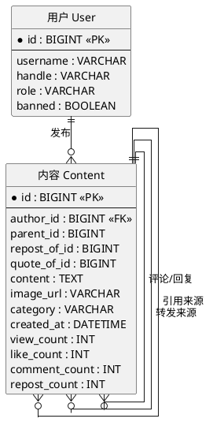
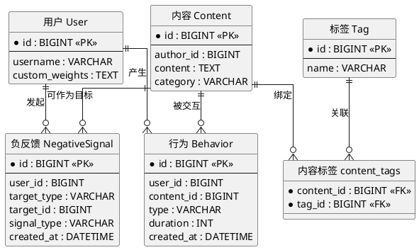
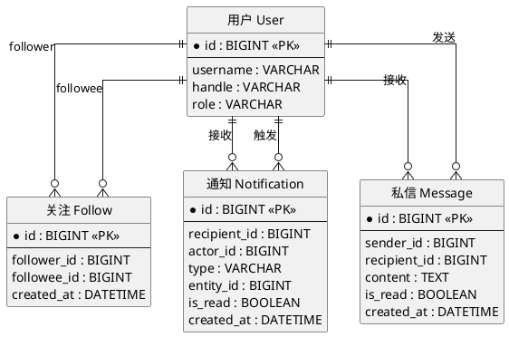
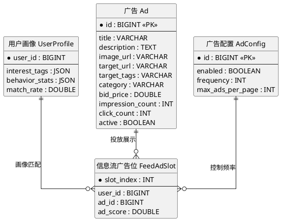

# 3.3 局部 E-R 图 PlantUML 代码

> 使用方式：复制对应代码到 PlantUML 渲染工具，导出 PNG 后插入到 Word 文档中标注的位置。

## 图 3-3（a）用户与内容局部 E-R 图

```plantuml
@startuml
hide circle
skinparam linetype ortho
skinparam shadowing false
skinparam entity {
  BackgroundColor White
  BorderColor #1f2937
}

entity "用户 User" as user {
  * id : BIGINT <<PK>>
  --
  username : VARCHAR
  handle : VARCHAR
  role : VARCHAR
  banned : BOOLEAN
}

entity "内容 Content" as content {
  * id : BIGINT <<PK>>
  --
  author_id : BIGINT <<FK>>
  parent_id : BIGINT
  repost_of_id : BIGINT
  quote_of_id : BIGINT
  content : TEXT
  image_url : VARCHAR
  category : VARCHAR
  created_at : DATETIME
  view_count : INT
  like_count : INT
  comment_count : INT
  repost_count : INT
}

user ||--o{ content : 发布
content ||--o{ content : 评论/回复
content ||--o{ content : 转发来源
content ||--o{ content : 引用来源
@enduml
```

## 图 3-3（b）行为画像与标签局部 E-R 图

```plantuml
@startuml
hide circle
skinparam linetype ortho
skinparam shadowing false
skinparam entity {
  BackgroundColor White
  BorderColor #1f2937
}

entity "用户 User" as user {
  * id : BIGINT <<PK>>
  --
  username : VARCHAR
  custom_weights : TEXT
}

entity "内容 Content" as content {
  * id : BIGINT <<PK>>
  --
  author_id : BIGINT
  content : TEXT
  category : VARCHAR
}

entity "行为 Behavior" as behavior {
  * id : BIGINT <<PK>>
  --
  user_id : BIGINT
  content_id : BIGINT
  type : VARCHAR
  duration : INT
  created_at : DATETIME
}

entity "标签 Tag" as tag {
  * id : BIGINT <<PK>>
  --
  name : VARCHAR
}

entity "内容标签 content_tags" as content_tags {
  * content_id : BIGINT <<FK>>
  * tag_id : BIGINT <<FK>>
}

entity "负反馈 NegativeSignal" as negative {
  * id : BIGINT <<PK>>
  --
  user_id : BIGINT
  target_type : VARCHAR
  target_id : BIGINT
  signal_type : VARCHAR
  created_at : DATETIME
}

user ||--o{ behavior : 产生
content ||--o{ behavior : 被交互
content ||--o{ content_tags : 绑定
tag ||--o{ content_tags : 关联
user ||--o{ negative : 发起
content ||--o{ negative : 可作为目标
@enduml
```

## 图 3-3（c）社交关系与消息通知局部 E-R 图

```plantuml
@startuml
hide circle
skinparam linetype ortho
skinparam shadowing false
skinparam entity {
  BackgroundColor White
  BorderColor #1f2937
}

entity "用户 User" as user {
  * id : BIGINT <<PK>>
  --
  username : VARCHAR
  handle : VARCHAR
  role : VARCHAR
}

entity "关注 Follow" as follow {
  * id : BIGINT <<PK>>
  --
  follower_id : BIGINT
  followee_id : BIGINT
  created_at : DATETIME
}

entity "通知 Notification" as notification {
  * id : BIGINT <<PK>>
  --
  recipient_id : BIGINT
  actor_id : BIGINT
  type : VARCHAR
  entity_id : BIGINT
  is_read : BOOLEAN
  created_at : DATETIME
}

entity "私信 Message" as message {
  * id : BIGINT <<PK>>
  --
  sender_id : BIGINT
  recipient_id : BIGINT
  content : TEXT
  is_read : BOOLEAN
  created_at : DATETIME
}

user ||--o{ follow : follower
user ||--o{ follow : followee
user ||--o{ notification : 接收
user ||--o{ notification : 触发
user ||--o{ message : 发送
user ||--o{ message : 接收
@enduml
```

## 图 3-3（d）广告投放局部 E-R 图

```plantuml
@startuml
hide circle
skinparam linetype ortho
skinparam shadowing false
skinparam entity {
  BackgroundColor White
  BorderColor #1f2937
}

entity "用户画像 UserProfile" as profile {
  * user_id : BIGINT
  --
  interest_tags : JSON
  behavior_stats : JSON
  match_rate : DOUBLE
}

entity "广告 Ad" as ad {
  * id : BIGINT <<PK>>
  --
  title : VARCHAR
  description : TEXT
  image_url : VARCHAR
  target_url : VARCHAR
  target_tags : VARCHAR
  category : VARCHAR
  bid_price : DOUBLE
  impression_count : INT
  click_count : INT
  active : BOOLEAN
}

entity "广告配置 AdConfig" as config {
  * id : BIGINT <<PK>>
  --
  enabled : BOOLEAN
  frequency : INT
  max_ads_per_page : INT
}

entity "信息流广告位 FeedAdSlot" as slot {
  * slot_index : INT
  --
  user_id : BIGINT
  ad_id : BIGINT
  ad_score : DOUBLE
}

profile ||--o{ slot : 画像匹配
ad ||--o{ slot : 投放展示
config ||--o{ slot : 控制频率
@enduml
```
